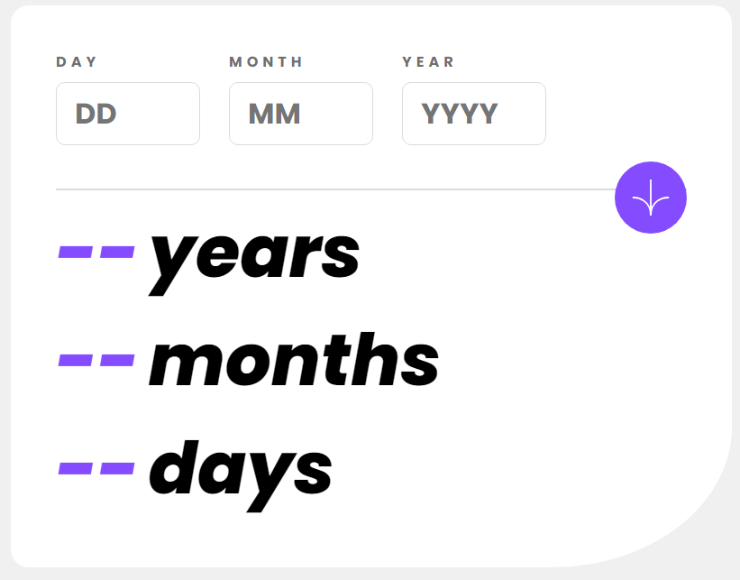

# Frontend Mentor - Age calculator app solution

This is a solution to the [Age calculator app challenge on Frontend Mentor](https://www.frontendmentor.io/challenges/age-calculator-app-dF9DFFpj-Q). Frontend Mentor challenges help you improve your coding skills by building realistic projects.

## Table of contents

- [Overview](#overview)
  - [The challenge](#the-challenge)
  - [Screenshot](#screenshot)
  - [Links](#links)
- [My process](#my-process)
  - [Built with](#built-with)
  - [What I learned](#what-i-learned)
  - [Useful resources](#useful-resources)
- [Author](#author)

## Overview

### The challenge

Users should be able to:

- View an age in years, months, and days after submitting a valid date through the form
- Receive validation errors if:
  - Any field is empty when the form is submitted
  - The day number is not between 1-31
  - The month number is not between 1-12
  - The year is in the future
  - The date is invalid e.g. 31/04/1991 (there are 30 days in April)
- View the optimal layout for the interface depending on their device's screen size
- See hover and focus states for all interactive elements on the page
- **Bonus**: See the age numbers animate to their final number when the form is submitted

### Screenshot

### Links

- Github URL: [Github URL](https://github.com/exchyphen/fm_age-calculator)
- Live Site URL: [live site hosted by Github Pages](https://exchyphen.github.io/fm_age-calculator/)

## My process

### Built with

- HTML
- CSS
- JavaScript
- React

### What I learned

Practice with sending data between components, especially for this project's error handling.

### Useful resources

- [MDN - Date Object](https://developer.mozilla.org/en-US/docs/Web/JavaScript/Reference/Global_Objects/Date) - Good refresher on how to use the Date object.
- [Stack Overflow - Hide Input Arrows](https://stackoverflow.com/questions/3790935/can-i-hide-the-html5-number-input-s-spin-box) - Found a good answer to hide the standard arrows from HTML number input.
- [Age Calculator](https://www.calculatorsoup.com/calculators/time/age-calculator.php) - Site to help double check my age calculations.

## Author

- Github - [exchyphen](https://github.com/exchyphen)
- Frontend Mentor - [@exchyphen](https://www.frontendmentor.io/profile/exchyphen)
